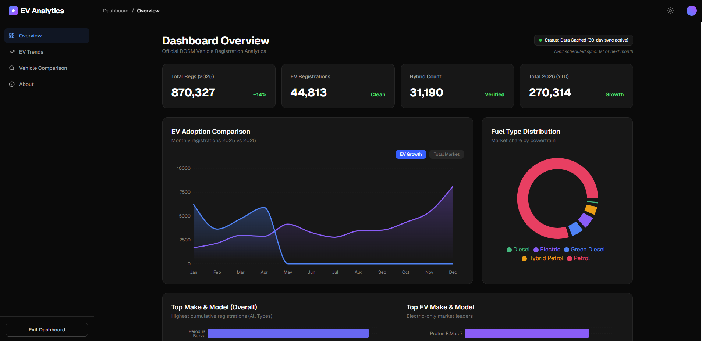

# 🏎️ Malaysia EV Analytic / Automotive Market Dashboard
### Experience Malaysia's Sustainable Transport Transition through Open Data

A high-performance, professional analytics dashboard designed to visualize the rapidly evolving automotive landscape in Malaysia. This project leverages official Department of Statistics Malaysia (DOSM) registration data to provide deep insights into Electric Vehicle (EV) adoption, market share shifts, and regional growth trends.

## 🌐 Live Demo
https://ev-adoption-malaysia-dashboard.vercel.app/



## 🌟 Key Features

### 📊 Real-Time EV Adoption Trends
Track the velocity of the electric vehicle transition with comparative monthly data (2025 vs 2026). Visualize growth rates, year-to-date performance, and cumulative milestones.

### 🧩 Market Share Intelligence
A comprehensive breakdown of powertrain distribution across the country. Compare Petrol, Hybrid, and Electric shares in real-time, calibrated directly from official parquet datasets.

### 🏆 Manufacturer & Model Leaderboards
Who is leading the race? Dynamic rankings of the top-performing brands and models in the Malaysian EV space, featuring performance indicators and volume metrics.

### 📍 Regional Adoption Heatmaps
Identify Malaysia's sustainable transport hubs. Distribution analytics across every state and territory, including private vs corporate registration ratios.

## 🛠️ Tech Stack

- **Frontend**: React 19, TypeScript, Vite
- **Styling**: Tailwind CSS
- **Visualization**: Recharts (Customized Premium Themes)
- **Animations**: Framer Motion
- **Data Engineering**: Python (Pandas/Polars), Apache Parquet
- **Deployment**: Optimized Production Build Support

## 🚀 Execution Guide

### 1. Prerequisites
- **Node.js** (v18+)
- **Python** (v3.10+)

### 2. Data Synchronization
The system processes raw open data files provided by DOSM. To update the dashboard with the latest metrics:
```bash
# Navigate to the data pipeline
cd data_pipeline
pip install -r requirements.txt
python sync_data.py
```
This script aggregates millions of registration rows into optimized JSON summaries for the dashboard.

### 3. Frontend Setup
```bash
# Install dependencies
npm install

# Start development server
npm run dev

# Build for production
npm run build
npm run preview
```

## 📈 Market Impact
This dashboard is built to demystify Malaysia’s shift toward sustainable transport. By converting complex parquet datasets into actionable insights, it serves as a powerful tool for analysts, enthusiasts, and policymakers to monitor the progress of the National Energy Transition Roadmap (NETR).

---
**Author**: [Alwin Ashraf](https://www.linkedin.com/in/alwin-ashraf-nor-azmil-4628a9223/)  
**Data Source**: Official Open Data from [DOSM (Department of Statistics Malaysia)](https://data.gov.my/)
